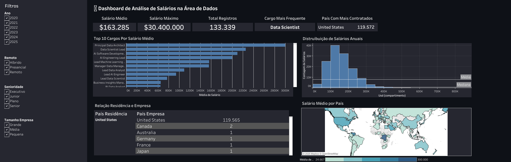

# 💰 Análise de Salários na Área de Dados

**🚧 Projeto em Evolução | Em Desenvolvimento Ativo**

Atualmente implementando a conexão direta com **PostgreSQL** para tornar os dashboards mais dinâmicos e escaláveis.

## 🎯 Sobre o Projeto

Comparação prática do mesmo dashboard de salários da área de dados implementado em 3 ferramentas diferentes: **Streamlit, Tableau e Power BI**.

## 📊 Dashboards Implementados

### 🚀 Streamlit (Python)
**Link:** [Acessar Dashboard Streamlit](https://dash-app-alura.streamlit.app/))  
**Descrição:** Dashboard interativo com filtros dinâmicos, gráficos Plotly e análise em tempo real.

### 🎨 Tableau Public
**Link:** [Acessar Dashboard Tableau](https://public.tableau.com/app/profile/gabriel.castanheira/viz/AnlisedeSalrios/PainelAnlisedeSalriosnareadedados)  
**Descrição:** Visualizações profissionais com drill-down e ferramentas de análise integradas.

### 📈 Power BI
**Link:** [Acessar Relatório Power BI](reports/dashboard.pbix)  
**Descrição:** Relatório corporativo com métricas business e formatação condicional.

### 🗃️ PostgreSQL
**Scripts:** [Consultas SQL](sql/)
**Descrição:** Modelagem do banco e consultas analíticas para extração de insights.

## 🛠️ Tecnologias Utilizadas

- **Python:** Pandas, NumPy, Plotly, Streamlit
- **Visualização:** Tableau, Power BI
- **Banco de Dados:** PostgreSQL
- **Ferramentas:** Jupyter Notebook, Git

## 📁 Estrutura do Projeto
