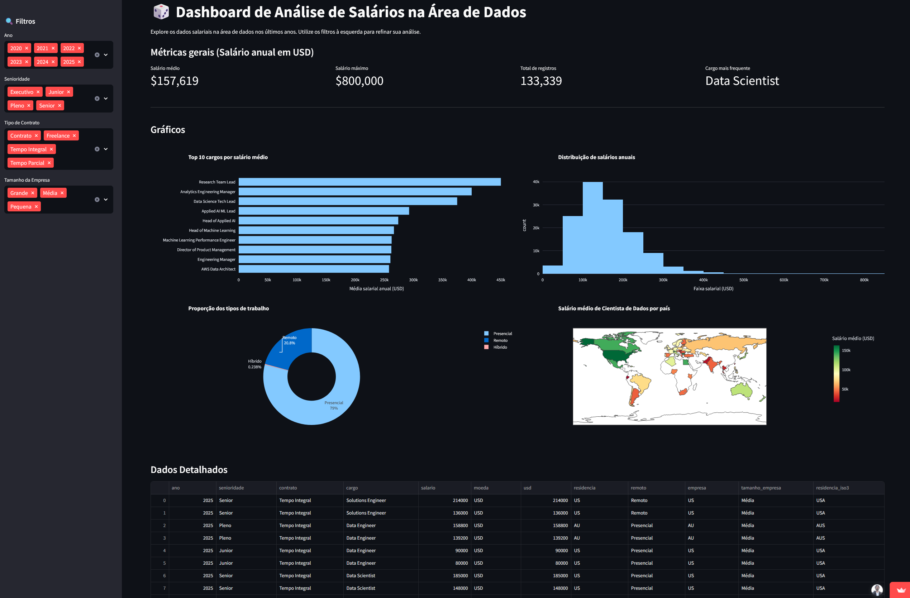
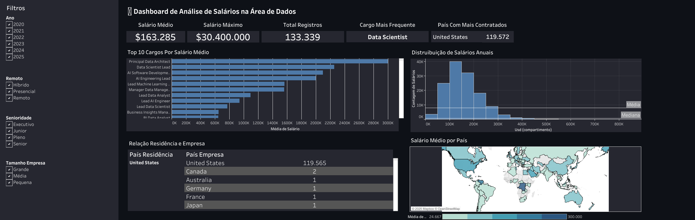

# 💰 Análise de Salários na Área de Dados

**🚧 Projeto em Evolução | Em Desenvolvimento Ativo**

Atualmente implementando a conexão direta com **PostgreSQL** para tornar os dashboards mais dinâmicos e escaláveis.

## 🎯 Sobre o Projeto

Comparação prática do mesmo dashboard de salários da área de dados implementado em 3 ferramentas diferentes: **Streamlit, Tableau e Power BI**.

## 📊 Dashboards Implementados

### 🚀 Streamlit (Python)
**Link:** [Acessar Dashboard Streamlit](https://dash-app-alura.streamlit.app/)  
**Descrição:** Dashboard interativo com filtros dinâmicos, gráficos Plotly e análise em tempo real.

### 🎨 Tableau Public
**Link:** [Acessar Dashboard Tableau](https://public.tableau.com/app/profile/gabriel.castanheira/viz/AnlisedeSalrios/PainelAnlisedeSalriosnareadedados)  
**Descrição:** A visualização de gráfico em donut foi trocada por uma mais apropriada, pois por motivos como perda de precisão, em que ângulos similares geram dificuldade de comparação visual, foi preferível fazer outro gráfico e trazer dados mostrando quais nacionalidades e quantas pessoas, cada país contrata. Adicionei também linhas médias e mediana na distribuição de Salários Anuais, e dois KPIs foram trocados por outros indicadores.

### 📈 Power BI (em construção)
**Link:** [Acessar Relatório Power BI](1_dashboards/Dash_Análise_Salários.pbix)  
**Descrição:** Relatório corporativo com métricas business e formatação condicional.

### 🗃️ PostgreSQL
**Scripts:** [Consultas SQL](sql/)
**Descrição:** Modelagem do banco e consultas analíticas para extração de insights.

## 🛠️ Tecnologias Utilizadas

- **Python:** Pandas, NumPy, Plotly, Streamlit
- **Visualização:** Tableau, Power BI
- **Banco de Dados:** PostgreSQL
- **Ferramentas:** Jupyter Notebook, Git

## 📁 Estrutura do Projeto
